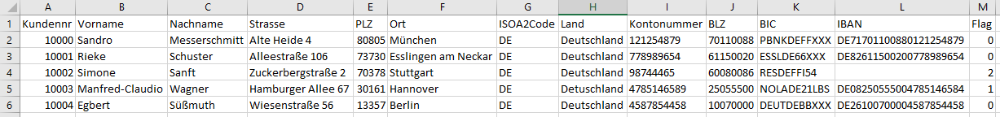

# IBAN prüfen
Gegeben ist die Datei "kunden.alt", welche Kundendaten enthält. Sie sollen diese Datei im ersten Schritt auslesen und die darin enthaltenen IBAN Nummern prüfen.

Fehlermeldungen, bei falschen oder nicht vorhandenen IBAN Nummern sind in die LOG Datei "kunden_check.log" zu schreiben. Alle Datensätze werden in eine "kunden_neu.csv" Datei gespeichert. Dabei enthält die Spalte "Flag" eine 0 wenn IBAN okay, eine 1 wenn IBAN falsch und eine 2 wenn keine IBAN vorhanden ist.

Die Datei beinhaltet folgende Spalten:



Bei der Prüfung sind folgende Punkte zu beachten:

- Ist keine IBAN hinterlegt, wird ein Fehler an der Konsole ausgegeben und in die LOG-Datei geschrieben
- Ist eine falsche IBAN hinterleget wird ebenfalls der Fehler an der Konsole ausgegeben und in die LOG-Datei geschrieben
- Ist die IBAN i.O. erfolgt nur eine Ausgabe in der Konsole, dass die IBAN okay ist

Für die Prüfung der IBAN legen Sie eine neue "Pruefziffern.cs" Datei an und schreiben eine separate Funktion:
```
public static string IbanTest(string blz, string konto, string isoa2)
```
Das Einlesen der Daten erfolgt ebenfalls in einer separaten Datei "Import.cs" mit Hilfe der Funktion:
```
public static object ReadData(string filename)
```
In der Program-Main Funktion erstellen Sie für das Schreiben der LOG Datei, sowie für das Löschen der LOG Datei zwei weitere Funktionen:
```
static void LoescheLog(string logfile)
static void SchreibeLog(string message, string logfile)
```
**Bauen Sie an den wesentlichen Stellen im Programmablauf eine Fehlerprüfung mit sinnvollen Fehlermeldungen ein, sodass das Programm immer kontrolliert arbeitet bzw. mit einer Fehlermeldung beendet wird!!!**